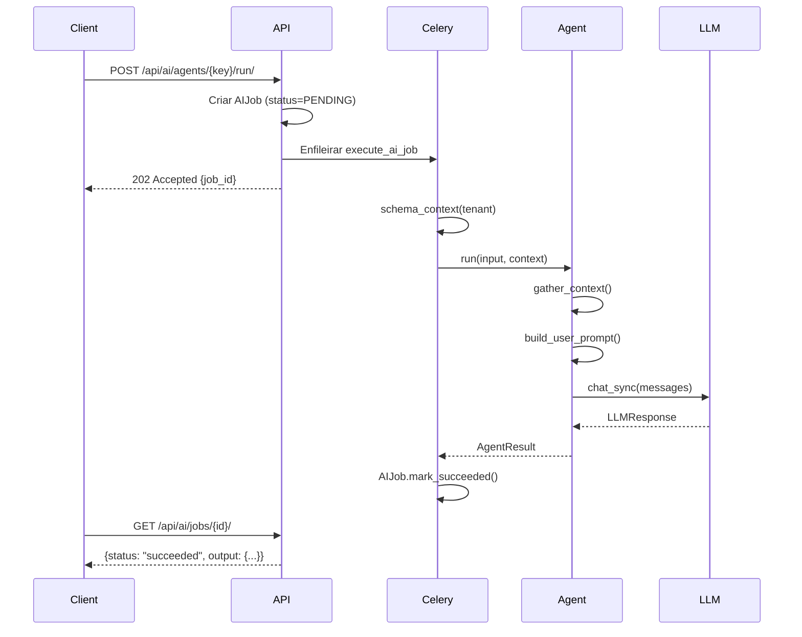

# AI - Visão Geral

## 1. Introdução

O módulo AI do ClimaTrak implementa agentes de inteligência artificial para suporte à manutenção industrial e HVAC. Os agentes auxiliam em:

- **Análise de Causa Raiz (RCA)**: Identificar hipóteses para alertas
- **Manutenção Preventiva**: Recomendar ações preventivas baseadas em histórico
- **Manutenção Preditiva**: Prever falhas com base em telemetria e padrões
- **Gestão de Inventário**: Otimizar níveis de estoque baseado em consumo
- **Reparos Rápidos**: Assistente guiado para técnicos em campo

## 2. Arquitetura

```
apps/ai/
├── __init__.py
├── apps.py                  # Configuração do app Django
├── models.py                # AIJob (modelo de execução)
├── admin.py                 # Admin Django
├── serializers.py           # DRF serializers
├── views.py                 # ViewSets DRF
├── urls.py                  # Rotas API
├── services.py              # Service layer (AIJobService)
├── tasks.py                 # Celery tasks
├── providers/               # Clientes LLM
│   ├── __init__.py
│   ├── base.py              # Interface abstrata
│   ├── openai_compat.py     # Cliente OpenAI-compat (Z.ai, vLLM)
│   └── factory.py           # Factory para providers
├── agents/                  # Implementações de agentes
│   ├── __init__.py
│   ├── base.py              # Classe base abstrata
│   ├── registry.py          # Registry de agentes
│   └── dummy.py             # Agente de teste
├── migrations/
└── tests/
```

## 3. Fluxo de Execução



## 4. Multi-Tenancy

O módulo respeita o isolamento multi-tenant do ClimaTrak:

- **AIJob.tenant_id**: UUID do tenant, denormalizado para queries eficientes
- **Execução em schema_context**: Tasks Celery executam dentro do contexto correto
- **Isolamento de dados**: Queries sempre filtram por tenant_id

```python
# Task Celery com isolamento
@shared_task
def execute_ai_job(job_id: str, schema_name: str):
    with schema_context(schema_name):
        job = AIJob.objects.get(id=job_id)
        # Execução isolada no tenant
```

## 5. Idempotência

Jobs suportam idempotency_key para evitar duplicatas:

```python
# Mesma key = mesmo job (não duplica)
job, created = AIJobService.create_job(
    agent_key="root_cause",
    input_data={"alert_id": "..."},
    idempotency_key=f"rca:{alert_id}:v1",
)
```

## 6. LLM Provider

O sistema usa API OpenAI-compatível, permitindo:

- **Z.ai** (cloud, default) - GLM-4.7-Flash (Free tier)
- **vLLM** (GPU, produção)
- **OpenAI** (cloud)
- **LocalAI**, **Mistral**, etc.

### Configuração (.env)

```bash
# Z.ai GLM-4.7-Flash (Free tier) - default
LLM_PROVIDER=openai_compat
LLM_BASE_URL=https://api.z.ai/api/paas/v4
LLM_MODEL=glm-4.7-flash
LLM_API_KEY=your-api-key  # ou ZAI_API_KEY
LLM_TEMPERATURE=0.2
LLM_MAX_TOKENS=4096
LLM_TIMEOUT_SECONDS=60
```

## 7. Agentes Planejados

| Agent Key | Descrição | Status |
|-----------|-----------|--------|
| `dummy` | Agente de teste | ✅ Implementado |
| `root_cause` | Análise de causa raiz (RCA) | ✅ Implementado (AI-002) |
| `inventory` | Otimização de estoque | ✅ Implementado (AI-004) |
| `preventive` | Recomendações preventivas | ✅ Implementado (AI-005) |
| `predictive` | Manutenção preditiva | ✅ Implementado (AI-005) |
| `patterns` | Padrões de manutenção | ✅ Implementado (AI-005) |
| `quick_repair` | Assistente de reparos | 🔜 Planejado (AI-003) |

## 8. Próximos Passos

1. **AI-002**: ✅ Implementado agente RCA (`root_cause`)
2. **AI-004**: ✅ Implementado agente Inventário (`inventory`)
3. **AI-005**: ✅ Implementados agentes Preventivo, Preditivo e Padrões
4. **AI-003**: Implementar agente Quick Repair

## 9. Referências

- [02-contrato-api.md](02-contrato-api.md) - Contrato da API REST
- [03-agent-root-cause.md](03-agent-root-cause.md) - Documentação do RootCauseAgent
- [04-agent-inventory.md](04-agent-inventory.md) - Documentação do InventoryAgent
- [05-agent-maintenance.md](05-agent-maintenance.md) - Documentação dos agentes Preventive, Predictive, Patterns
